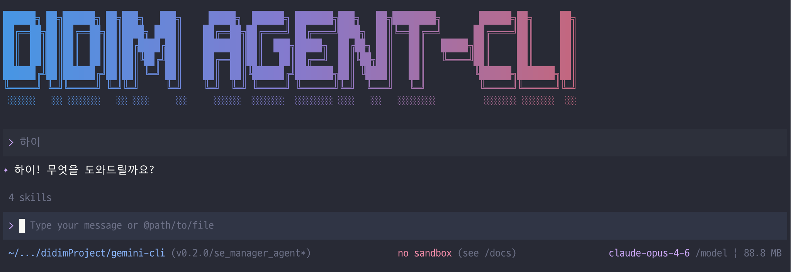

# Didim Agent CLI

[](https://github.com/google-gemini/gemini-cli/actions/workflows/ci.yml)
[](https://github.com/google-gemini/gemini-cli/actions/workflows/chained_e2e.yml)
[](https://www.npmjs.com/package/@didim365/agent-cli)
[](https://github.com/google-gemini/gemini-cli/blob/main/LICENSE)



Didim Agent CLI is an open-source AI agent that brings the power of multiple AI
providers directly into your terminal. Built on the Gemini CLI foundation, it
supports **Gemini**, **Claude**, **OpenAI**, and **OpenAI-compatible** (vLLM,
Ollama, LM Studio) endpoints through a unified **provider adapter
architecture**, giving you the most direct path from your prompt to your
preferred model.

Learn all about Didim Agent CLI in our [documentation](./docs/index.md).

## 🚀 Why Didim Agent CLI?

- **🧠 Multi-provider support**: Use Gemini, Claude, OpenAI, or local models
  (vLLM/Ollama) — switch providers and models with `/model` or `/auth login`.
- **🔧 Built-in tools**: Google Search grounding, file operations, shell
  commands, web fetching — all tools work across providers.
- **🔌 Extensible**: MCP (Model Context Protocol) support with deterministic
  tool naming and sLM-compatible parameter normalization.
- **🤖 Sub-agent support**: Sub-agents work with all providers via the
  provider-independent `llm*` pipeline.
- **💻 Terminal-first**: Designed for developers who live in the command line.
- **🛡️ Open source**: Apache 2.0 licensed.

## 📦 Installation

### Pre-requisites before installation

- Node.js version 20 or higher
- macOS, Linux, or Windows

### Quick Install

#### Run instantly with npx

```bash
# Using npx (no installation required)
npx @didim365/agent-cli
```

#### Install globally with npm

```bash
npm install -g @didim365/agent-cli
```

#### Install globally with Homebrew (macOS/Linux)

```bash
brew install gemini-cli
```

#### Install globally with MacPorts (macOS)

```bash
sudo port install gemini-cli
```

#### Install with Anaconda (for restricted environments)

```bash
# Create and activate a new environment
conda create -y -n gemini_env -c conda-forge nodejs
conda activate gemini_env

# Install Gemini CLI globally via npm (inside the environment)
npm install -g @didim365/agent-cli
```

## Release Cadence and Tags

See [Releases](./docs/releases.md) for more details.

### Preview

New preview releases will be published each week at UTC 2359 on Tuesdays. These
releases will not have been fully vetted and may contain regressions or other
outstanding issues. Please help us test and install with `preview` tag.

```bash
npm install -g @didim365/agent-cli@preview
```

### Stable

- New stable releases will be published each week at UTC 2000 on Tuesdays, this
  will be the full promotion of last week's `preview` release + any bug fixes
  and validations. Use `latest` tag.

```bash
npm install -g @didim365/agent-cli@latest
```

### Nightly

- New releases will be published each day at UTC 0000. This will be all changes
  from the main branch as represented at time of release. It should be assumed
  there are pending validations and issues. Use `nightly` tag.

```bash
npm install -g @didim365/agent-cli@nightly
```

## 📋 Key Features

### Code Understanding & Generation

- Query and edit large codebases
- Generate new apps from PDFs, images, or sketches using multimodal capabilities
- Debug issues and troubleshoot with natural language

### Automation & Integration

- Automate operational tasks like querying pull requests or handling complex
  rebases
- Use MCP servers to connect new capabilities, including
  [media generation with Imagen, Veo or Lyria](https://github.com/GoogleCloudPlatform/vertex-ai-creative-studio/tree/main/experiments/mcp-genmedia)
- Run non-interactively in scripts for workflow automation

### Advanced Capabilities

- Ground your queries with built-in
  [Google Search](https://ai.google.dev/gemini-api/docs/grounding) for real-time
  information
- Conversation checkpointing to save and resume complex sessions
- Custom context files (AGENTS.md) to tailor behavior for your projects

### GitHub Integration

Integrate Gemini CLI directly into your GitHub workflows with
[**Gemini CLI GitHub Action**](https://github.com/google-github-actions/run-gemini-cli):

- **Pull Request Reviews**: Automated code review with contextual feedback and
  suggestions
- **Issue Triage**: Automated labeling and prioritization of GitHub issues based
  on content analysis
- **On-demand Assistance**: Mention `@gemini-cli` in issues and pull requests
  for help with debugging, explanations, or task delegation
- **Custom Workflows**: Build automated, scheduled and on-demand workflows
  tailored to your team's needs

## 🔐 Authentication Options

Choose the authentication method that best fits your needs. You can also use
`/auth login` inside the CLI to interactively select a provider and enter your
API key.

> **Note:** Both `DIDIM_*` and `GEMINI_*` environment variable prefixes are
> supported. The CLI uses a central `resolveEnv()` utility that checks `DIDIM_*`
> first, then falls back to `GEMINI_*` for backward compatibility.

### Option 1: Login with Google (Gemini)

**✨ Best for:** Individual developers and Gemini Code Assist license holders.

```bash
didim
# Select "Login with Google" and follow the browser authentication flow
```

For organization accounts, set your Google Cloud project first:

```bash
export GOOGLE_CLOUD_PROJECT="YOUR_PROJECT_ID"
didim
```

### Option 2: Gemini API Key

**✨ Best for:** Developers who need specific Gemini model control.

```bash
export GEMINI_API_KEY="YOUR_API_KEY"
didim
```

### Option 3: Claude (Anthropic)

**✨ Best for:** Developers who prefer Claude models (Opus, Sonnet, Haiku).

```bash
export ANTHROPIC_API_KEY="YOUR_API_KEY"
didim
```

### Option 4: OpenAI

**✨ Best for:** Developers who prefer OpenAI models (GPT-4.1, o3, o4-mini).

```bash
export OPENAI_API_KEY="YOUR_API_KEY"
didim
```

### Option 5: Vertex AI

**✨ Best for:** Enterprise teams and production workloads.

```bash
export GOOGLE_API_KEY="YOUR_API_KEY"
export GOOGLE_GENAI_USE_VERTEXAI=true
didim
```

### Option 6: OpenAI-compatible (vLLM, Ollama, LM Studio)

**✨ Best for:** Local/self-hosted models and privacy-sensitive environments.

```bash
export ENABLE_MULTI_PROVIDER=true
export LLM_PROVIDER=openai-compatible
export LLM_BASE_URL="http://localhost:8000/v1"
didim
```

For detailed setup for each provider, see the
[authentication guide](./docs/get-started/authentication.md) and
[provider guide](./docs/providers.md).

## 🚀 Getting Started

### Basic Usage

#### Start in current directory

```bash
didim
```

#### Include multiple directories

```bash
didim --include-directories ../lib,../docs
```

#### Use specific model

```bash
didim -m gemini-2.5-flash            # Gemini
didim -m claude-sonnet-4-5-20250929  # Claude
didim -m gpt-4.1                     # OpenAI
```

#### Non-interactive mode for scripts

Get a simple text response:

```bash
didim -p "Explain the architecture of this codebase"
```

For more advanced scripting, including how to parse JSON and handle errors, use
the `--output-format json` flag to get structured output:

```bash
didim -p "Explain the architecture of this codebase" --output-format json
```

For real-time event streaming (useful for monitoring long-running operations),
use `--output-format stream-json` to get newline-delimited JSON events:

```bash
didim -p "Run tests and deploy" --output-format stream-json
```

### Quick Examples

#### Start a new project

```bash
cd new-project/
didim
> Write me a Discord bot that answers questions using a FAQ.md file I will provide
```

#### Analyze existing code

```bash
git clone https://github.com/user/project
cd project
didim
> Give me a summary of all of the changes that went in yesterday
```

## 📚 Documentation

### Getting Started

- [**Quickstart Guide**](./docs/get-started/index.md) - Get up and running
  quickly.
- [**Authentication Setup**](./docs/get-started/authentication.md) - Detailed
  auth configuration.
- [**Configuration Guide**](./docs/get-started/configuration.md) - Settings and
  customization.
- [**Keyboard Shortcuts**](./docs/cli/keyboard-shortcuts.md) - Productivity
  tips.

### Core Features

- [**Commands Reference**](./docs/cli/commands.md) - All slash commands
  (`/help`, `/chat`, etc).
- [**Custom Commands**](./docs/cli/custom-commands.md) - Create your own
  reusable commands.
- [**Context Files (AGENTS.md)**](./docs/cli/gemini-md.md) - Provide persistent
  context to the CLI.
- [**Checkpointing**](./docs/cli/checkpointing.md) - Save and resume
  conversations.
- [**Token Caching**](./docs/cli/token-caching.md) - Optimize token usage.

### Tools & Extensions

- [**Built-in Tools Overview**](./docs/tools/index.md)
  - [File System Operations](./docs/tools/file-system.md)
  - [Shell Commands](./docs/tools/shell.md)
  - [Web Fetch & Search](./docs/tools/web-fetch.md)
- [**MCP Server Integration**](./docs/tools/mcp-server.md) - Extend with custom
  tools.
- [**Custom Extensions**](./docs/extensions/index.md) - Build and share your own
  commands.

### Advanced Topics

- [**Headless Mode (Scripting)**](./docs/cli/headless.md) - Use Gemini CLI in
  automated workflows.
- [**Provider Guide**](./docs/providers.md) - Multi-provider runtime usage
  (`gemini`, `claude`, `openai`, `openai-compatible` including vLLM).
- [**Multi-Provider Configuration**](./docs/configuration.md) - Environment
  variables and precedence for provider/model resolution.
- [**Migration Guide**](./docs/migration.md) - Move from Gemini-only to
  provider-independent (`llm*`) call paths.
- [**Provider Adapter API**](./docs/api/providers.md) - Adapter contract and
  streaming/event types overview.
- [**Architecture Overview**](./docs/architecture.md) - How Gemini CLI works.
- [**IDE Integration**](./docs/ide-integration/index.md) - VS Code companion.
- [**Sandboxing & Security**](./docs/cli/sandbox.md) - Safe execution
  environments.
- [**Trusted Folders**](./docs/cli/trusted-folders.md) - Control execution
  policies by folder.
- [**Enterprise Guide**](./docs/cli/enterprise.md) - Deploy and manage in a
  corporate environment.
- [**Telemetry & Monitoring**](./docs/cli/telemetry.md) - Usage tracking.
- [**Tools API Development**](./docs/core/tools-api.md) - Create custom tools.
- [**Local development**](./docs/local-development.md) - Local development
  tooling.

### vLLM Quick Start

```bash
export ENABLE_MULTI_PROVIDER=true
export LLM_PROVIDER=openai-compatible
export LLM_BASE_URL="http://localhost:8000/v1"
export LLM_MODEL="Qwen/Qwen2.5-7B-Instruct"
didim -m Qwen/Qwen2.5-7B-Instruct
```

### Troubleshooting & Support

- [**Troubleshooting Guide**](./docs/troubleshooting.md) - Common issues and
  solutions.
- [**FAQ**](./docs/faq.md) - Frequently asked questions.
- Use `/bug` command to report issues directly from the CLI.

### Using MCP Servers

Configure MCP servers in `~/.didim/settings.json` (or `~/.gemini/settings.json`
for backward compatibility) to extend the CLI with custom tools:

```text
> @github List my open pull requests
> @slack Send a summary of today's commits to #dev channel
> @database Run a query to find inactive users
```

MCP tool naming is **deterministic** — tools are registered with consistent
names regardless of server discovery order. Tool parameters are automatically
normalized via schema-based coercion, with enhanced tolerance for sLM (small
Language Model) tool call formatting.

See the [MCP Server Integration guide](./docs/tools/mcp-server.md) for setup
instructions.

## 🤝 Contributing

We welcome contributions! Gemini CLI is fully open source (Apache 2.0), and we
encourage the community to:

- Report bugs and suggest features.
- Improve documentation.
- Submit code improvements.
- Share your MCP servers and extensions.

See our [Contributing Guide](./CONTRIBUTING.md) for development setup, coding
standards, and how to submit pull requests.

Check our [Official Roadmap](https://github.com/orgs/google-gemini/projects/11)
for planned features and priorities.

## 📖 Resources

- **[Official Roadmap](./ROADMAP.md)** - See what's coming next.
- **[Changelog](./docs/changelogs/index.md)** - See recent notable updates.
- **[NPM Package](https://www.npmjs.com/package/@didim365/agent-cli)** - Package
  registry.
- **[GitHub Issues](https://github.com/google-gemini/gemini-cli/issues)** -
  Report bugs or request features.
- **[Security Advisories](https://github.com/google-gemini/gemini-cli/security/advisories)** -
  Security updates.

### Uninstall

See the [Uninstall Guide](docs/cli/uninstall.md) for removal instructions.

## 📄 Legal

- **License**: [Apache License 2.0](LICENSE)
- **Terms of Service**: [Terms & Privacy](./docs/tos-privacy.md)
- **Security**: [Security Policy](SECURITY.md)

---

<p align="center">
  Built on Gemini CLI by Google — extended by Didim365
</p>
