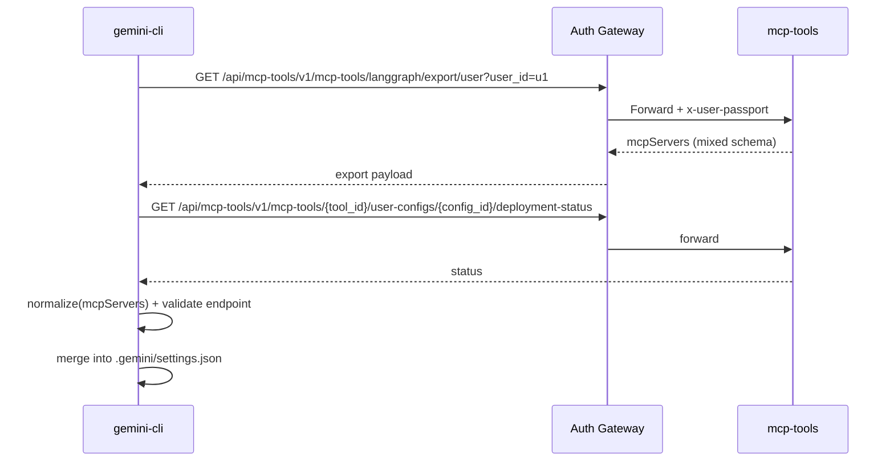
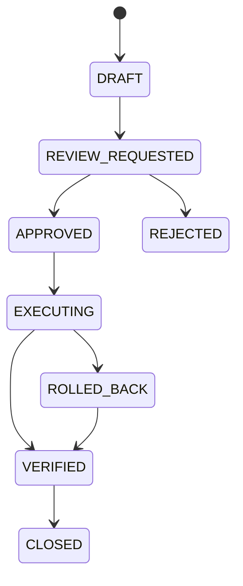

# System Engineer Agent - DidimAIStudio 연동 고도화 설계서 (코드검증 반영)

## 0. 문서 목적 및 결론

본 문서는 `gemini-cli`를 SE(System Engineer) Manager 중심 운영 에이전트로 전환할
때, DidimAIStudio와의 연동을 **실제 코드 기준**으로 재검증하고 설계를 고도화한
버전이다.

핵심 결론:

1. `DidimAIStudio 연동`은 효과적이다.
2. 단, `Role+Context`, `Governance`, `SE Workflow`는 gemini-cli 내부에서
   유지/강화해야 한다.
3. 기존 설계의 주요 보완점은 다음 4가지다.

- 인증 경로 표준화: `Auth Gateway(/api/{service}/{path})` 경유를 기본으로 채택
- MCP 설정 정규화: `langgraph/export` 응답 형식 차이를 CLI 호환 스키마로 변환
- 사용자별 MCP 배포 절차 반영: `user-config 생성 -> deploy -> status -> tools`
  검증 체인
- 보안 경계 명확화: `serving-mcp` 외부 노출 금지, `scenario-gateway`는 외부
  API-key 용도 분리

---

## 1. 코드 기반 현재 상태 요약

### 1.1 서비스 역할(확인)

- `indexing`: RAG 인덱싱/검색 서비스
- `mcp-tools(mcp-control)`: MCP 도구 등록/설정/배포 제어(Control Plane)
- `serving-mcp(mcp-runtime)`: MCP 도구 컨테이너 런타임(Data Plane)
- `auth`: 인증/인가 + API Gateway + passport 헤더 주입
- `agents`: LangGraph 기반 agentic 서비스(시나리오 실행/히스토리)
- `scenario-gateway`: API-Key 기반 시나리오 외부 서빙 게이트웨이

### 1.2 핵심 API/경로 사실

1. `mcp-tools`

- 라우터 prefix: `/v1/mcp-tools`
- 사용자 배포 핵심:
  - `POST /v1/mcp-tools/{tool_id}/user-configs/{config_id}:deploy`
  - `GET /v1/mcp-tools/{tool_id}/user-configs/{config_id}/deployment-status`
  - `GET /v1/mcp-tools/{tool_id}/user-configs/{config_id}/tools`
- export:
  - `POST /v1/mcp-tools/langgraph/export`
  - `GET /v1/mcp-tools/langgraph/export/user`
  - `GET /v1/mcp-tools/{tool_id}/langgraph/export`

2. `indexing`

- 검색 API: `POST /v1/embeddings/retrieval`
- 인증 의존: `get_parsed_jwt_data`가 `x-user-passport`를 실질적으로 요구

3. `agents`

- invoke: `/v1/invoke`, `/v1/invoke/sse`
- invoke payload 필수: `scenario_my_page_id`, `user_id`, `thread_id`, `qa_id`,
  `message`
- 인증: passport 우선, JWT 폴백(개발 편의 로직 존재)

4. `scenario-gateway`

- app prefix: `/api/v1`
- 공개 invoke: `POST /api/v1/invoke`, `POST /api/v1/invoke/sse`
- API-key 미들웨어 보호 경로는 현재 위 2개 중심
- `/invoke/sse/improved` 엔드포인트는 있으나 운영 표준 경로로 채택 전 검증 필요

5. `auth gateway`

- 동적 라우팅: `/api/{service}/{path:path}`
- `GatewayAuthMiddleware`가 bearer 검증 후 `x-user-passport` 헤더를 추가
- 따라서 CLI에서 단일 Bearer로 `indexing/agents/mcp-tools` 접근이 가능

6. `serving-mcp`

- health/metrics/tools/ws 라우터는 있으나 별도 인증 미들웨어 강제 구조는
  보수적으로 봐야 함
- 운영 정책상 내부망 전용으로 제한해야 함

---

## 2. 기존 설계 대비 논리 보완사항

| 구분                  | 기존 설계 리스크                           | 코드 검증 결과                                              | 보완 설계                                                         |
| --------------------- | ------------------------------------------ | ----------------------------------------------------------- | ----------------------------------------------------------------- |
| API 경로              | `/api/v1/...`와 서비스 원경로 혼용         | 서비스별 기본 prefix 상이 (`/v1`, `/api/v1`)                | CLI 표준 호출 경로를 `Auth Gateway`로 통일 (`/api/{service}/...`) |
| MCP Export            | export 응답을 그대로 CLI mcpServers에 반영 | 응답 형식이 `transport/url` 또는 `command/http+args`로 혼재 | `MCP Config Normalizer` 계층 추가                                 |
| MCP 배포              | export 중심으로만 설계                     | 실제 운영은 `user-config deploy/status/tools` 절차가 핵심   | 배포 상태 검증 후에만 settings 반영                               |
| Indexing 인증         | 단순 Bearer 가정                           | 실질적으로 `x-user-passport` 필요                           | Auth Gateway 경유 기본화                                          |
| serving-mcp 노출      | 외부 접근 가능성 미정                      | 런타임은 도구 실행 평면                                     | 외부 차단, mcp-tools 통해서만 제어                                |
| scenario-gateway 사용 | 내부 운영에도 사용 가능 가정               | API-key 시나리오 서빙 목적                                  | SE 내부 운영은 agents 직접/게이트웨이 경유 우선                   |
| 추적성                | request_id 중심                            | 변경/승인/세션 상관키 부족                                  | `request_id/change_id/approval_id/session_id` 전파 강제           |

---

## 3. 목표 아키텍처 (고도화)

### 3.1 레이어 책임 분리

- `Role + Context Layer (gemini-cli)`: SE 운영 원칙, SLO/SLI, 런북 문맥
- `Governance Layer (gemini-cli)`: 승인 강제, 위험명령 차단, 사후검증/롤백
- `Workflow Layer (gemini-cli)`: `/incident:triage`, `/change:review`,
  `/postmortem:create`
- `Ops Platform Layer (DidimAIStudio)`: auth, indexing, agents, mcp-tools,
  serving-mcp
- `Audit/Report Layer (gemini-cli 중심)`: 실행 로그 저장 + 결과 문서 자동 생성

### 3.2 시스템 구성도

```mermaid
flowchart TB
    U[SE Manager]
    CLI[gemini-cli\nSE Agent Runtime]

    subgraph CLI_L[CLI Layers]
      SP[System Prompt\n(.gemini/system.md)]
      CTX[Context Hierarchy\nGEMINI.md ops/runbooks]
      GOV[Policy + Hooks]
      WF[SE Commands/Skills]
      LOG[Run Store + Report]
    end

    subgraph DIDIM[DidimAIStudio]
      AUTH[Auth + API Gateway]
      IDX[Indexing RAG]
      AGT[Agents LangGraph]
      MCPCTL[mcp-tools\nControl Plane]
      MCPRT[serving-mcp\nRuntime Plane]
      SCG[scenario-gateway\nAPI-key ingress]
    end

    subgraph EXT[External Ops APIs]
      PD[PagerDuty]
      DD[Datadog]
      JR[Jira]
      K8S[Kubernetes]
    end

    U --> CLI
    CLI --> SP
    CLI --> CTX
    CLI --> GOV
    CLI --> WF
    CLI --> LOG

    WF --> AUTH
    CTX --> AUTH

    AUTH --> IDX
    AUTH --> AGT
    AUTH --> MCPCTL

    MCPCTL --> MCPRT
    MCPRT --> PD
    MCPRT --> DD
    MCPRT --> JR
    MCPRT --> K8S

    SCG --> AGT
```

### 3.3 운영 플로우(승인/실행/롤백)

```mermaid
flowchart TD
    A[SE 요청 입력] --> B[Role+Context 로딩]
    B --> C[RAG 조회\n(Auth->Indexing)]
    C --> D[작업계획서 생성]
    D --> E{Policy 검사}
    E -->|deny| X[차단 + 사유]
    E -->|ask_user| F[결재 요청/승인]
    F --> G{승인 완료?}
    G -->|No| X
    G -->|Yes| H[MCP 실행\n(mcp-tools->serving-mcp)]
    E -->|allow| H
    H --> I[AfterTool 검증]
    I --> J{SLI/SLO 통과?}
    J -->|No| K[롤백 실행]
    J -->|Yes| L[작업결과서 작성]
    K --> L
    L --> M[events/artifacts 저장]
    M --> N[자동 report.md 생성]
```

---

## 4. 연동 표준 경로 설계

### 4.1 권장 호출 경로(기본)

CLI는 가능한 한 Auth Gateway를 통해 호출한다.

- RAG 검색
  - `POST /api/indexing/v1/embeddings/retrieval`
- Agent 실행
  - `POST /api/agents/v1/invoke`
  - `POST /api/agents/v1/invoke/sse`
- MCP 관리
  - `GET /api/mcp-tools/v1/mcp-tools/langgraph/export/user?user_id={id}`
  - `POST /api/mcp-tools/v1/mcp-tools/{tool_id}/user-configs/{config_id}:deploy`
  - `GET /api/mcp-tools/v1/mcp-tools/{tool_id}/user-configs/{config_id}/deployment-status`
  - `GET /api/mcp-tools/v1/mcp-tools/{tool_id}/user-configs/{config_id}/tools`

### 4.2 직접 호출 경로(예외)

- 내부 디버그/장애복구 시에만 허용
- 이 경우 `x-user-passport` 주입 책임이 CLI/운영 스크립트에 있음

### 4.3 scenario-gateway 사용 원칙

- 목적: 외부 API-key 소비자 시나리오 서빙
- 내부 SE 운영(온콜/변경관리)에서는 기본적으로 `agents` 직접(또는 auth gateway
  경유) 사용
- `/api/v1/invoke/sse/improved`는 인증 정책 정합성 확인 전 기본 경로에서 제외

---

## 5. MCP 연동 고도화 설계

### 5.1 사용자별 배포 선행 절차(필수)

1. 사용자 설정 생성/선택 (`user-config`)
2. `deploy` 호출
3. `deployment-status`가 RUNNING/HEALTHY 확인
4. `tools` 조회로 실제 MCP 함수 가용성 확인
5. 이후에만 export 결과를 CLI `mcpServers`에 반영

### 5.2 MCP Export 정규화 계층

`mcp-tools` export 결과는 형식이 혼재될 수 있으므로 CLI 반영 전 정규화가
필요하다.

정규화 규칙:

1. `transport + url` 형식

- `transport: streamable_http` -> CLI `{ url, type: "http" }`
- `transport: sse` -> CLI `{ url, type: "sse" }`
- `headers`는 그대로 전달

2. `command/http + args[0]=URL` 형식

- `command == "http"` and `args[0]` URL이면 네트워크 transport로 변환
- CLI `{ url: args[0], type: "http" }`
- `endpoint` 필드는 메타데이터로만 저장(실행설정에는 미반영)

3. `command`가 실제 stdio 실행 명령인 경우

- CLI `{ command, args, env, cwd }` 유지

4. 품질 게이트

- URL이 placeholder/내부 테스트 대역(`192.168.x`, localhost fallback 등)이면
  배포상태 재검증 없이는 반영 금지

### 5.3 settings 반영 정책

- 대상: `.gemini/settings.json`의 `mcpServers`
- merge 정책:
  - `didim.*` 네임스페이스로 관리 (`didim.datadog`, `didim.jira`)
  - 수동 등록 서버와 충돌 시 수동 설정 우선
- write 시 감사 필드 기록:
  - `synced_at`, `sync_source`, `user_id`, `request_id`

### 5.4 동기화 흐름도



---

## 6. Role/Context/Governance/Workflow 상세

### 6.1 Role 규칙

- 파일: `.gemini/system.md`
- 활성화: `GEMINI_SYSTEM_MD=1`
- 강제 규칙:
  - 계획/리스크/롤백 없는 변경 실행 금지
  - 장애 시 완전수정 전 완화조치 우선
  - 승인 ID 없는 운영 write 금지

### 6.2 Context 계층

- `GEMINI.md`(공통), `ops/GEMINI.md`, `runbooks/GEMINI.md`,
  `services/<svc>/GEMINI.md`
- 설정 키:
  - `context.fileName`
  - `context.includeDirectories`

### 6.3 Governance(정책/훅)

- 위험 명령 deny: `rm -rf`, `kubectl delete`, `DROP TABLE` 등
- 승인 체크:
  - `work_plan.status == APPROVED`
  - `approval_id` 존재/유효성
- Hook 체인:
  - `BeforeTool`: 승인/변경창/대상 검증
  - `AfterTool`: SLI/SLO 검증 + 증적 수집
  - `SessionEnd`: report 생성 + 아카이브

### 6.4 Workflow 명령

- `/incident:triage`
- `/change:review`
- `/postmortem:create`

실행 상태 머신:



---

## 7. Audit/Report 고도화

### 7.1 저장 구조

- `.gemini/se-ops/runs/YYYY/MM/DD/<session_id>/session.json`
- `.gemini/se-ops/runs/YYYY/MM/DD/<session_id>/events.ndjson`
- `.gemini/se-ops/runs/YYYY/MM/DD/<session_id>/artifacts/*.md`
- `.gemini/se-ops/runs/YYYY/MM/DD/<session_id>/report.md`

### 7.2 최소 상관키 스키마

- `request_id`
- `change_id`
- `approval_id`
- `session_id`
- `plan_id`
- `tool_call_id`
- `didim_service` / `didim_endpoint`
- `decision(allow/deny/ask_user)`
- `result`

### 7.3 Didim 데이터 조인

- `agents histories` + `mcp-tools deployment 로그` + CLI events를 상관키로 조인
- 보고서 섹션:
  - 변경요약
  - 승인이력
  - 실행/검증 결과
  - 롤백 여부
  - 재발방지 액션

---

## 8. 구현 단계(고도화 버전)

### Phase 1. 인증/경로 표준화 (1주)

- Auth Gateway 경유 호출 클라이언트 구현
- Direct 호출 fallback(긴급모드) 분기 구현

완료 기준:

- indexing/agents/mcp-tools 호출이 Bearer 1개로 성공

### Phase 2. MCP 동기화 + 정규화 (1~2주)

- export 수집 -> normalize -> validate -> settings 반영
- user-config deploy/status/tools 게이트 구현

완료 기준:

- 잘못된 endpoint 자동 차단
- 사용자별 MCP 자동 로드 성공

### Phase 3. Governance/Workflow 강제 (2주)

- Policy/Hooks + 승인 상태머신
- `/incident:triage`, `/change:review`, `/postmortem:create`

완료 기준:

- 승인 없는 write 0건
- 검증 실패 시 롤백 체인 100% 실행

### Phase 4. Audit/Report 자동화 (1주)

- session end 자동 보고서
- Didim 로그 조인

완료 기준:

- 세션 종료 후 report 생성 성공률 95%+

---

## 9. 운영 리스크 및 대응

1. Export 스키마 변경

- 대응: Normalizer 계약 테스트 + 버전 필드 검증

2. Gateway 장애

- 대응: 직접호출 비상모드 + `x-user-passport` 주입 스크립트

3. Runtime 노출 위험

- 대응: `serving-mcp` 내부망 제한, 방화벽/Ingress 차단

4. Scenario Gateway 경로 혼용

- 대응: 내부 운영은 agents 경로 표준화, scenario-gateway는 외부 API-key 전용

---

## 10. 코드 근거 파일(검증 기준)

- `didimAIStudio/services/mcp-control/app/api/v1/router.py`
- `didimAIStudio/services/mcp-control/app/api/v1/endpoints/mcp_tools_api.py`
- `didimAIStudio/services/mcp-control/app/api/v1/endpoints/mcp_tools_user_api.py`
- `didimAIStudio/services/mcp-control/app/service/mcp_tool_config_service.py`
- `didimAIStudio/services/mcp-control/app/utils/mcp_config_manager.py`
- `didimAIStudio/services/indexing/app/api/v1/endpoints/embeddings_api.py`
- `didimAIStudio/services/indexing/app/utils/auth_utils.py`
- `didimAIStudio/services/agents/app/dto/invoke_dto.py`
- `didimAIStudio/services/agents/app/middleware/auth_middleware.py`
- `didimAIStudio/services/scenario-gateway/app/main.py`
- `didimAIStudio/services/scenario-gateway/app/middleware/api_key_auth_middleware.py`
- `didimAIStudio/services/scenario-gateway/app/api/v1/endpoints/scenario_api.py`
- `didimAIStudio/services/auth/app/main.py`
- `didimAIStudio/services/auth/app/middleware/gateway_auth.py`
- `didimAIStudio/services/auth/app/gateway/api_gateway.py`
- `didimAIStudio/services/auth/services_local.yaml`
- `didimAIStudio/infra/compose/docker-compose.base.yml`
- `gemini-cli/packages/core/src/core/prompts.ts`
- `gemini-cli/packages/cli/src/config/settingsSchema.ts`
- `gemini-cli/packages/core/src/config/config.ts`
- `gemini-cli/packages/core/src/tools/mcp-client.ts`
