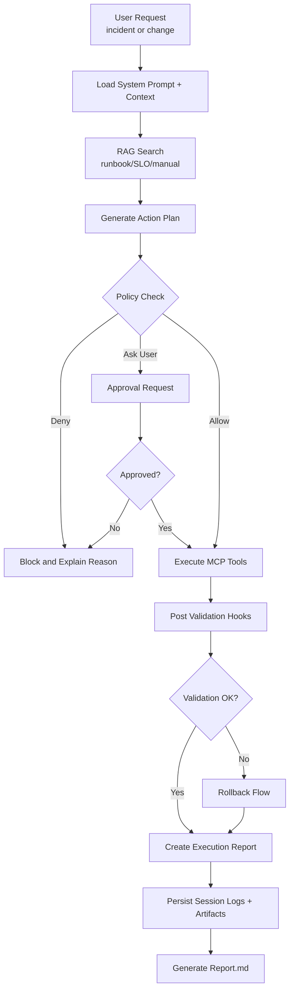
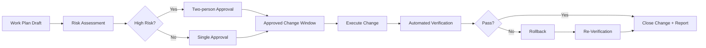

# System Engineer Agent CLI 전환 작업/설계서

## 1. 문서 목적

본 문서는 현재 `agent-cli(gemini-cli 기반)`를 "코드 생성 중심"에서 "SE(System
Engineer) 운영관리 중심" 에이전트로 전환하기 위한 설계와 구현 계획을 정의한다.

핵심 목표는 다음 4가지다.

- 장애 대응 중심 운영 에이전트화 (`triage -> 승인 -> 실행 -> 검증 -> 롤백`)
- 회사별 운영 매뉴얼 기반 RAG 도입
- 작업계획서/결재/작업결과서 등 절차적 통제 내재화
- 모든 실행 이력의 구조화 저장 및 자동 리포트 출력

---

## 2. 범위 및 전제

### 범위

- CLI 설정/프롬프트/정책/훅/커맨드/스킬 계층 설계
- MCP 기반 외부 운영 시스템 연동 설계
- 운영 이력 저장 및 리포트 자동화 파이프라인 설계

### 비범위(초기 단계)

- 특정 벤더 API의 완전 구현 (PagerDuty/Datadog/Jira/K8s 실제 API 호출 코드는 PoC
  이후)
- 기업별 결재선/권한 모델의 상세 인사시스템 연동

### 참고 경로

- 시스템 프롬프트: `docs/cli/system-prompt.md`,
  `packages/core/src/core/prompts.ts`
- 컨텍스트 계층: `docs/cli/gemini-md.md`, `packages/cli/src/config/config.ts`
- 설정 스키마: `packages/cli/src/config/settingsSchema.ts`
- MCP/확장: `docs/extensions/reference.md`
- 정책/훅: `docs/core/policy-engine.md`, `docs/hooks/reference.md`
- 커맨드/스킬: `docs/cli/custom-commands.md`, `docs/cli/skills.md`

---

## 3. 목표 아키텍처

### 3.1 논리 계층

1. Role Layer

- `GEMINI_SYSTEM_MD=1` + `.gemini/system.md`로 SE 운영 우선 행동규칙 강제

2. Domain Context Layer

- `GEMINI.md/AGENTS.md` 계층에 SLO/SLI, 장애등급, 런북, 온콜 절차 분리
- 사내 운영 매뉴얼은 RAG 색인 저장소와 연결

3. Ops Integration Layer

- MCP 서버로 PagerDuty/Datadog/Jira/K8s 연동
- 확장(extension)으로 재사용 가능한 배포 단위화

4. Governance Layer

- Policy 엔진 + Hooks로 위험 명령 차단, 승인 게이트, 사후검증 자동화

5. Workflow Layer

- `/incident:triage`, `/change:review`, `/postmortem:create` 커맨드
- 필요 시 스킬 기반 심층 워크플로우 활성화

6. Audit/Report Layer

- 모든 실행 이벤트를 구조화 로그로 저장
- 주/월/장애건별 리포트 자동 생성

### 3.2 처리 흐름

1. 사용자 요청 입력
2. Role/Context 주입
3. 정책 검사 (차단/승인 필요/허용)
4. MCP 조회 및 실행계획 생성
5. 결재 단계 수행
6. 작업 실행 및 자동 검증
7. 결과서/회고서 생성
8. 실행 로그 저장 + 리포트 업데이트

### 3.3 시스템 구성도 (Mermaid)

```mermaid
flowchart TB
    U[SE Manager / On-call Engineer]
    CLI[agent-cli]

    subgraph L1[Role + Context Layer]
        SP[.gemini/system.md<br/>GEMINI_SYSTEM_MD=1]
        CTX[GEMINI.md/AGENTS.md Hierarchy<br/>SLO/SLI, Runbook, Incident Policy]
        RAG[RAG Retriever<br/>Ops Manuals Index]
    end

    subgraph L2[Governance Layer]
        PE[Policy Engine<br/>allow/deny/ask_user]
        HK[Hooks<br/>BeforeTool/AfterTool/SessionEnd]
        AP[Approval Gate<br/>Plan/Approval ID Validation]
    end

    subgraph L3[Workflow Layer]
        CMD[/incident:triage<br/>/change:review<br/>/postmortem:create]
        SK[Skills<br/>incident/change/postmortem]
    end

    subgraph L4[Ops Integration Layer]
        MCP[MCP Router]
        PD[PagerDuty MCP]
        DD[Datadog MCP]
        JR[Jira MCP]
        K8S[K8s MCP]
    end

    subgraph L5[Audit & Report Layer]
        LOG[events.ndjson/session.json]
        DOC[Work Plan/Approval/Execution/Postmortem]
        REP[Auto Reports<br/>daily/incident/change]
    end

    U --> CLI
    CLI --> SP
    CLI --> CTX
    CTX --> RAG
    CLI --> PE
    PE --> HK
    HK --> AP
    CLI --> CMD
    CMD --> SK
    CLI --> MCP
    MCP --> PD
    MCP --> DD
    MCP --> JR
    MCP --> K8S
    HK --> LOG
    CMD --> DOC
    LOG --> REP
    DOC --> REP
```

### 3.4 요소 간 운영 흐름도 (Mermaid)



### 3.5 변경 작업 승인/롤백 상세 흐름도 (Mermaid)



---

## 4. 상세 설계 (요청 5개 항목 중심)

## 4.1 역할 규칙 (System Prompt)

### 목표

"코드 생성 우선"이 아닌 "장애 triage, 변경 승인, 롤백 우선" 규칙을 시스템
레벨에서 강제한다.

### 적용안

- 파일: `.gemini/system.md`
- 실행: `GEMINI_SYSTEM_MD=1`

### system.md 필수 규칙

- 변경 전 필수: 영향범위/위험도/롤백전략 없는 실행 금지
- 장애 대응 우선순위: 탐지 -> 등급분류 -> 완화(완전해결 우선 아님) -> RCA
- 승인 필요 작업 분류: 운영환경 쓰기, 배포, DB 변경, 권한 변경
- 기본 응답 형식: `상황요약 / 가설 / 즉시조치 / 승인필요항목 / 롤백계획`

### 산출물

- `.gemini/system.md` (SE manager 규칙 집약)
- 온보딩 문서에 실행 방법 추가 (`GEMINI_SYSTEM_MD=1 gemini`)

---

## 4.2 도메인 컨텍스트 (AGENT.md/GEMINI.md 계층)

### 목표

SE 운영 지식을 코드 문맥과 분리하여 계층형으로 관리한다.

### 설정 키

- `context.fileName`
- `context.includeDirectories`

### 권장 구조

- `GEMINI.md` (최상위 운영 원칙)
- `ops/GEMINI.md` (SLO/SLI, 장애등급, 온콜 규정)
- `runbooks/GEMINI.md` (시스템별 조치 절차)
- `services/<service>/GEMINI.md` (서비스 개별 운영 특이사항)

### RAG 연계 방식

- 운영 매뉴얼 원문: `docs/ops-manuals/**`
- 인덱스 메타데이터: 시스템명, 버전, 적용기간, 소유팀, 보안등급
- 질의 시: 최근 유효 버전 + 서비스 범위 + 장애유형 필터 기반 검색

### 산출물

- 컨텍스트 파일 템플릿
- `settings.json` 내 컨텍스트 디렉터리 정책

---

## 4.3 운영 시스템 연동 (MCP/Extension)

### 목표

운영 도구 API를 표준화된 MCP 툴로 노출하여 에이전트가 안전하게 조회/실행한다.

### 1차 대상 MCP

- `pagerduty` (incidents, oncall, escalation)
- `datadog` (monitors, metrics, events)
- `jira` (change ticket, incident issue)
- `k8s` (namespace, rollout status, events, logs)

### 배치 방식

1. 프로젝트 로컬: `.gemini/settings.json` 의 `mcpServers`
2. 공통 배포: extension의 `gemini-extension.json`

### 인터페이스 원칙

- Read/Write 툴 분리 (`get_*` vs `apply_*`)
- 운영환경(write) 호출은 승인 토큰 필요
- 모든 MCP 호출에 `request_id`, `change_id`, `operator` 부여

### 산출물

- MCP 서버 목록 및 인증 정책 문서
- extension 패키지 초안 (`mcp + commands + hooks + skills` 번들)

---

## 4.4 가드레일 (Policy/Hooks)

### 목표

위험 명령 차단, 승인 절차 강제, 변경 후 검증 자동화를 정책 기반으로 강제한다.

### Policy 설계

- 기본 원칙: 쓰기/쉘은 `ask_user` 유지
- 추가 차단 규칙:
  - 파괴적 명령 (`rm -rf`, `kubectl delete`, `drop table` 등) 기본 deny
  - 승인 없는 운영환경 변경 command deny
  - 승인 ticket 없는 MCP write tool deny

### Hooks 설계

- `BeforeTool`: 변경행위 요청 시 승인 ID/변경계획서 존재 검증
- `AfterTool`: 실행 결과에서 검증 체크리스트 자동 수행
- `AfterAgent`: 결과서 형식 누락 시 자동 재작성 요구
- `SessionEnd`: 세션 요약 및 로그 인덱싱 실행

### 산출물

- `.gemini/policies/se-guardrails.toml`
- `.gemini/hooks/*.sh` 또는 `*.js` (검증/기록 훅)

---

## 4.5 운영 업무 워크플로우 (Commands/Skills)

### 목표

SE 운영 절차를 커맨드/스킬로 표준화한다.

### 커맨드

- `/incident:triage`
  - 입력: 증상/알람ID/영향서비스
  - 출력: 장애등급, 초기가설, 즉시완화, 커뮤니케이션 초안

- `/change:review`
  - 입력: 작업계획서ID, 변경대상, 위험도
  - 출력: 승인 체크리스트, 사전검증, 롤백플랜 검토

- `/postmortem:create`
  - 입력: incident ID, 타임라인 로그
  - 출력: RCA, 재발방지 액션, 책임/기한

### 스킬

- `incident-triage-manager`
- `change-approval-manager`
- `postmortem-writer`

### 산출물

- `.gemini/commands/incident/triage.toml`
- `.gemini/commands/change/review.toml`
- `.gemini/commands/postmortem/create.toml`
- `.gemini/skills/*/SKILL.md`

---

## 5. 절차적 요소 설계 (계획서/결재/결과서)

### 5.1 문서 모델

1. 작업계획서 (Work Plan)

- 필드: `plan_id`, `service`, `objective`, `risk_level`, `blast_radius`,
  `rollback_plan`, `validation_plan`, `window`

2. 결재정보 (Approval)

- 필드: `approval_id`, `plan_id`, `approver`, `status`, `approved_at`,
  `conditions`

3. 작업결과서 (Execution Report)

- 필드: `exec_id`, `plan_id`, `actions`, `verification_result`, `rollback_used`,
  `issues`

4. 장애결과서 (Postmortem)

- 필드: `incident_id`, `timeline`, `root_cause`, `corrective_actions`, `owners`,
  `due_dates`

### 5.2 상태 전이

- `DRAFT -> REVIEW_REQUESTED -> APPROVED -> EXECUTED -> VERIFIED -> CLOSED`
- `APPROVED -> ROLLED_BACK -> VERIFIED -> CLOSED`

### 5.3 통제 규칙

- APPROVED 이전 write 실행 금지
- VERIFIED 실패 시 CLOSED 금지
- 고위험 변경은 2인 승인(4-eyes) 필수

---

## 6. 실행 이력 저장 및 자동 리포트

### 6.1 저장 목표

CLI에서 수행된 모든 의사결정/툴호출/결과를 재현 가능하게 저장한다.

### 6.2 저장 위치(안)

- `.gemini/se-ops/runs/YYYY/MM/DD/<session_id>/`

### 6.3 저장 항목

- `session.json` (세션 메타)
- `events.ndjson` (행위 이벤트 로그)
- `artifacts/` (계획서, 승인서, 결과서, 포스트모템)
- `report.md` (자동 생성 요약)

### 6.4 이벤트 스키마(요약)

- `timestamp`, `session_id`, `user`, `command`, `tool_name`, `tool_input_hash`,
  `decision`, `approval_id`, `result`, `latency_ms`

### 6.5 리포트 자동화

- 트리거: `SessionEnd` hook
- 출력:
  - 일일 운영 리포트
  - 장애건 리포트
  - 변경작업 성공률/롤백률 리포트

---

## 7. 단계별 구현 계획

## Phase 0: 설계 확정 (1주)

- 본 문서 리뷰/승인
- 장애등급/승인정책/문서 템플릿 확정

완료 기준

- 운영팀 합의된 정책 표준 1차본 완료

## Phase 1: Prompt + Context 기반 전환 (1~2주)

- `.gemini/system.md` 작성 및 운영
- `context.fileName`, `context.includeDirectories` 적용
- 운영 매뉴얼 디렉터리 구조 정리

완료 기준

- SE 절차 우선 응답 패턴 안정화

## Phase 2: Guardrail 구축 (2주)

- 정책 파일/훅 스크립트 도입
- 승인 없는 write 차단
- 변경 후 검증 자동체크 연결

완료 기준

- 위험 명령 차단율 100%, 승인 누락 0건

## Phase 3: MCP/Workflow 구축 (2~4주)

- PagerDuty/Datadog/Jira/K8s MCP 연동
- `/incident:triage`, `/change:review`, `/postmortem:create` 도입
- 스킬 3종 추가

완료 기준

- 주요 SE 운영 시나리오 80% 이상 CLI 재현 가능

## Phase 4: Audit/Report 자동화 (2주)

- 실행 이력 저장소 및 집계 배치 구축
- 자동 보고서 템플릿/생성기 구축

완료 기준

- 세션 종료 후 자동 리포트 생성 성공률 95% 이상

---

## 8. 보안/컴플라이언스 고려사항

- 운영 매뉴얼 RAG 데이터는 보안등급별 저장소 분리
- PII/비밀정보는 hooks에서 마스킹 후 저장
- 감사 추적을 위해 해시 체인 또는 서명 기반 무결성 검토
- 운영환경 write 툴은 최소권한 IAM 적용

---

## 9. KPI (도입 효과 측정)

- MTTA(평균 인지시간), MTTM(평균 완화시간), MTTR
- 변경 실패율(Change Failure Rate)
- 롤백 발생률
- 승인 누락률
- 포스트모템 작성 리드타임
- 반복 장애 재발률

---

## 10. 즉시 실행 To-Do

1. `.gemini/system.md` 초안 작성 및 `GEMINI_SYSTEM_MD=1` 운영 시작
2. 운영 컨텍스트 파일 계층(`ops/`, `runbooks/`, `services/`) 생성
3. `.gemini/settings.json`에 `context`, `mcpServers`, `hooksConfig` 기본값 반영
4. `.gemini/policies/se-guardrails.toml` 및 최소 훅(`BeforeTool`, `SessionEnd`)
   작성
5. `/incident:triage`, `/change:review`, `/postmortem:create` 커맨드 템플릿 추가
6. 실행 이력 저장 구조(`.gemini/se-ops/runs/...`)와 `report.md` 생성기 연결
