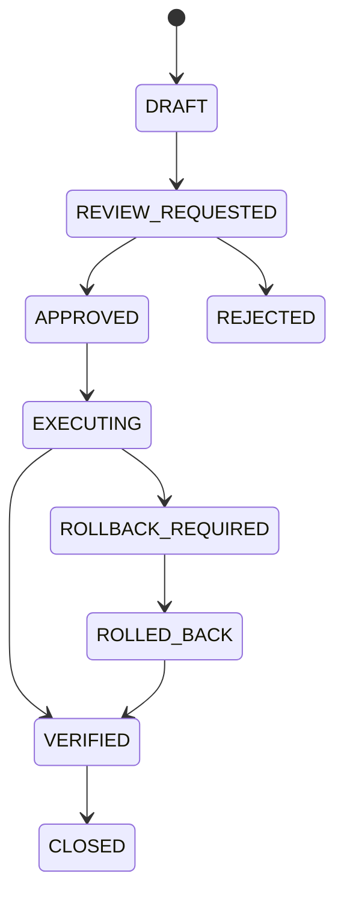
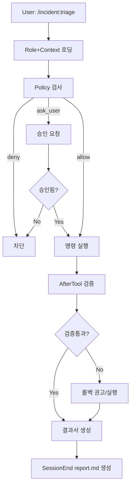

# SE Workflow 전용 설계서 (gemini-cli 내부 구현)

## 1. 문서 목적

본 문서는 `gemini-cli(agent-cli)`에 아래 3개 계층만 추가 구현하는 상세 설계를
정의한다.

- `Role + Context`
- `Governance`
- `SE Workflow`

본 설계는 `DidimAIStudio 연동` 없이도 단독 동작 가능한 운영 절차 자동화를 목표로
한다.

---

## 2. 범위

### 2.1 포함

- 시스템 프롬프트 오버라이드 기반 SE 행동 규칙 강제
- GEMINI.md 계층 기반 운영 컨텍스트 구조화
- Policy + Hooks 기반 승인/차단/검증 강제
- 커스텀 명령(`/incident:triage`, `/change:review`, `/postmortem:create`) 및
  스킬 설계
- 실행 산출물 저장(계획서/승인서/결과서/회고서)

### 2.2 제외

- 외부 시스템 API(PagerDuty/Jira/Datadog/K8s) 실제 연동
- 외부 RAG/DB 서비스 구축
- 조직 인사시스템 결재선 연계

---

## 3. 코드 기준 제약 및 전제

### 3.1 확인된 핵심 제약

1. 시스템 프롬프트 오버라이드

- `GEMINI_SYSTEM_MD=1` 또는 경로 지정 시 `.gemini/system.md` 적용
- 근거: `packages/core/src/core/prompts.ts`

2. 컨텍스트 설정 키

- `context.fileName`, `context.includeDirectories`
- 근거: `packages/cli/src/config/settingsSchema.ts`

3. 훅 설정 키

- `hooksConfig.enabled`, `hooksConfig.disabled`, `hooks.BeforeTool`,
  `hooks.AfterTool`, `hooks.SessionEnd` 등
- 근거: `packages/cli/src/config/settingsSchema.ts`, `docs/hooks/reference.md`

4. 정책 파일 위치

- 사용자 정책: `~/.gemini/policies/*.toml`
- 관리자 정책: 시스템 정책 디렉터리
- 주의: 프로젝트 로컬 `.gemini/policies`는 공식 사용자 정책 로드 경로가 아님
- 근거: `packages/core/src/policy/config.ts`,
  `packages/core/src/config/storage.ts`, `docs/core/policy-engine.md`

5. 커스텀 명령/스킬 위치

- 프로젝트 명령: `.gemini/commands/**/*.toml`
- 프로젝트 스킬: `.gemini/skills/*/SKILL.md`
- 근거: `docs/cli/custom-commands.md`, `docs/cli/skills.md`

---

## 4. 목표 아키텍처

```mermaid
flowchart TB
    U[SE Manager] --> CLI[gemini-cli]

    subgraph ROLECTX[Role + Context]
      SYS[.gemini/system.md]
      MEM[GEMINI.md Hierarchy]
      SET[.gemini/settings.json context.*]
    end

    subgraph GOV[Governance]
      POL[~/.gemini/policies/se-guardrails.toml]
      HB[BeforeTool Hook]
      HA[AfterTool Hook]
      HS[SessionEnd Hook]
    end

    subgraph WF[SE Workflow]
      C1[/incident:triage]
      C2[/change:review]
      C3[/postmortem:create]
      SK[.gemini/skills/se-ops-*]
    end

    subgraph ART[Artifacts]
      P1[work-plan.json]
      P2[approval.json]
      P3[execution-report.json]
      P4[postmortem.md]
      P5[report.md]
    end

    CLI --> ROLECTX
    CLI --> GOV
    CLI --> WF
    GOV --> ART
    WF --> ART
```

---

## 5. Role + Context 상세 설계

## 5.1 System Prompt 강제

### 구현 파일

- `.gemini/system.md`

### 실행 방법

- `GEMINI_SYSTEM_MD=1 gemini`

### 필수 규칙(초안)

1. 장애 대응 우선순위

- 탐지 -> 등급분류 -> 영향완화 -> 근본원인 -> 영구조치

2. 변경 실행 전 필수 요건

- 작업계획서(`plan_id`) 존재
- 롤백계획 존재
- 검증체크리스트 존재
- 승인 필요 변경은 `approval_id` 확인 전 실행 금지

3. 출력 포맷 표준

- `상황요약`
- `가설`
- `즉시조치`
- `승인필요항목`
- `롤백계획`
- `검증결과`

## 5.2 Context 계층 구조

### 디렉터리 제안

```text
.
├─ GEMINI.md
├─ ops/
│  ├─ GEMINI.md
│  ├─ slo-sli.md
│  └─ incident-severity.md
├─ runbooks/
│  ├─ GEMINI.md
│  ├─ service-a.md
│  └─ service-b.md
└─ services/
   ├─ api/
   │  └─ GEMINI.md
   └─ worker/
      └─ GEMINI.md
```

### `.gemini/settings.json` 반영 예시

```json
{
  "experimental": {
    "skills": true
  },
  "context": {
    "fileName": ["GEMINI.md"],
    "includeDirectories": ["ops", "runbooks", "services"],
    "loadMemoryFromIncludeDirectories": true
  },
  "hooksConfig": {
    "enabled": true,
    "disabled": []
  }
}
```

## 5.3 컨텍스트 운영 원칙

1. 역할 분리

- `GEMINI.md`: 전역 운영원칙
- `ops/*`: 정책/SLO/온콜
- `runbooks/*`: 절차 중심
- `services/*`: 서비스 특이사항

2. 버전 관리

- 모든 런북 문서에 `last_updated`, `owner`, `service`, `severity_scope`
  메타데이터 추가

3. 우선순위

- 서비스 컨텍스트 > 런북 > ops 공통 > 전역 원칙

---

## 6. Governance 상세 설계

## 6.1 정책 엔진(Policy)

### 정책 파일

- `~/.gemini/policies/se-guardrails.toml`

### 정책 목표

- 위험명령 기본 `deny`
- 일반 조회성 명령 `allow`
- 경계 영역 `ask_user`

### 정책 예시

```toml
# 1) 조회성 명령 자동 허용
[[rule]]
toolName = "run_shell_command"
commandPrefix = ["ls", "pwd", "cat ", "rg ", "git status", "git log"]
decision = "allow"
priority = 200

# 2) 위험 명령 차단
[[rule]]
toolName = "run_shell_command"
commandRegex = "(rm -rf|kubectl\\s+delete|drop\\s+table|truncate\\s+table)"
decision = "deny"
priority = 900

# 3) 파일 수정 도구는 기본 승인 필요
[[rule]]
toolName = ["write_file", "replace", "edit"]
decision = "ask_user"
priority = 700

# 4) 쉘 실행은 기본 승인 필요 (조회성 allow보다 낮은 우선순위)
[[rule]]
toolName = "run_shell_command"
decision = "ask_user"
priority = 100
```

## 6.2 훅 체인(Hooks)

### 구현 파일

- `.gemini/hooks/se-before-tool.js`
- `.gemini/hooks/se-after-tool.js`
- `.gemini/hooks/se-session-end.js`

### 훅 역할

1. BeforeTool

- 실행 전 `approval_id`, `plan_id`, `change_window` 검증
- 조건 미충족 시 `decision=deny`

2. AfterTool

- 결과 기반 검증체크리스트 적용
- 실패 시 롤백 권고 컨텍스트 주입(`additionalContext`)

3. SessionEnd

- 세션 아티팩트 집계
- `report.md` 자동 생성

### `.gemini/settings.json` 훅 설정 예시

```json
{
  "hooksConfig": {
    "enabled": true,
    "disabled": []
  },
  "hooks": {
    "BeforeTool": [
      {
        "matcher": "run_shell_command|write_file|replace|edit|mcp__.*",
        "hooks": [
          {
            "type": "command",
            "name": "se-before-tool",
            "command": "node .gemini/hooks/se-before-tool.js",
            "timeout": 10000
          }
        ]
      }
    ],
    "AfterTool": [
      {
        "matcher": "run_shell_command|write_file|replace|edit|mcp__.*",
        "hooks": [
          {
            "type": "command",
            "name": "se-after-tool",
            "command": "node .gemini/hooks/se-after-tool.js",
            "timeout": 10000
          }
        ]
      }
    ],
    "SessionEnd": [
      {
        "hooks": [
          {
            "type": "command",
            "name": "se-session-end",
            "command": "node .gemini/hooks/se-session-end.js",
            "timeout": 15000
          }
        ]
      }
    ]
  }
}
```

## 6.3 승인 상태머신



## 6.4 아티팩트 스키마

### work-plan.json

```json
{
  "plan_id": "PLN-20260215-001",
  "service": "api",
  "objective": "error rate 완화",
  "risk_level": "HIGH",
  "blast_radius": "api-prod",
  "rollback_plan": "previous deployment restore",
  "validation_plan": ["error_rate<1%", "p95<500ms"],
  "change_window": "2026-02-16T01:00:00Z/2026-02-16T02:00:00Z",
  "status": "DRAFT"
}
```

### approval.json

```json
{
  "approval_id": "APR-20260215-007",
  "plan_id": "PLN-20260215-001",
  "approvers": ["se_manager_a", "se_manager_b"],
  "status": "APPROVED",
  "approved_at": "2026-02-15T12:00:00Z",
  "conditions": ["change window 준수", "rollback test 선행"]
}
```

### execution-report.json

```json
{
  "exec_id": "EXE-20260216-001",
  "plan_id": "PLN-20260215-001",
  "approval_id": "APR-20260215-007",
  "actions": ["rollout restart", "config patch"],
  "verification": {
    "error_rate": "0.3%",
    "p95": "420ms",
    "passed": true
  },
  "rollback_used": false,
  "status": "VERIFIED"
}
```

---

## 7. SE Workflow 상세 설계

## 7.1 커맨드 구성

### 파일 배치

```text
.gemini/commands/
├─ incident/
│  └─ triage.toml
├─ change/
│  └─ review.toml
└─ postmortem/
   └─ create.toml
```

### 1) `/incident:triage`

목표:

- 장애를 빠르게 분류하고, 즉시완화 중심 실행 계획을 산출

입력:

- `service`, `symptom`, `severity_candidate`, `time_range`

산출:

- `triage-summary.md`
- 임시 `work-plan.json` 초안

예시(`.gemini/commands/incident/triage.toml`):

```toml
description = "SE incident triage workflow"
prompt = """
너는 SE Incident Commander다.
입력: {{args}}
다음 순서로 처리하라:
1) 장애등급 분류(근거 포함)
2) 즉시완화 조치 3개 제시
3) 영향범위/블라스트 반경 추정
4) work-plan 초안 JSON 생성
출력은 '상황요약/가설/즉시조치/승인필요항목/롤백계획' 형식을 따른다.
"""
```

### 2) `/change:review`

목표:

- 변경 계획의 실행 가능성/리스크/승인 필요성 검토

입력:

- `plan_id`

산출:

- `approval-request.md`
- `approval.json`(요청 상태)

예시(`.gemini/commands/change/review.toml`):

```toml
description = "SE change review and approval gate"
prompt = """
입력된 plan_id({{args}})의 계획서를 검토하라.
검토 항목:
- 위험도, 블라스트 반경, 롤백 완결성, 검증 절차, 변경창 적합성
결과:
1) 승인 가능/불가
2) 보완 필요 항목
3) 승인 요청서 초안
"""
```

### 3) `/postmortem:create`

목표:

- 타임라인/원인/재발방지 액션을 구조화된 회고 문서로 생성

입력:

- `incident_id`, `time_range`

산출:

- `postmortem.md`

예시(`.gemini/commands/postmortem/create.toml`):

```toml
description = "Create SE postmortem from artifacts"
prompt = """
incident_id={{args}} 기준으로 artifacts를 분석해 postmortem을 작성하라.
필수 섹션:
- Summary
- Timeline(UTC)
- Root Cause
- What Went Well / Poorly
- Corrective Actions(owner, due date)
"""
```

## 7.2 스킬 구성

### 파일 배치

```text
.gemini/skills/
├─ se-incident-manager/SKILL.md
├─ se-change-manager/SKILL.md
└─ se-postmortem-writer/SKILL.md
```

### 스킬 역할

- 커맨드는 진입점, 스킬은 심화 절차/템플릿/체크리스트 제공
- 대규모 절차를 프롬프트에서 분리하여 재사용성 확보

### 예시(`.gemini/skills/se-change-manager/SKILL.md`)

```markdown
---
name: se-change-manager
description: 검증 가능한 변경계획서와 승인 게이트 점검이 필요한 경우 사용한다.
---

# SE Change Manager

1. 계획서 필수 항목 존재 여부 확인
2. 고위험 변경은 2인 승인 요구
3. 검증 실패 시 롤백 경로를 우선 제안
4. 결과는 approval-request.md 템플릿으로 반환
```

---

## 8. 저장소 구조 제안

```text
.gemini/
├─ system.md
├─ settings.json
├─ hooks/
│  ├─ se-before-tool.js
│  ├─ se-after-tool.js
│  └─ se-session-end.js
├─ commands/
│  ├─ incident/triage.toml
│  ├─ change/review.toml
│  └─ postmortem/create.toml
├─ skills/
│  ├─ se-incident-manager/SKILL.md
│  ├─ se-change-manager/SKILL.md
│  └─ se-postmortem-writer/SKILL.md
└─ se-ops/
   ├─ plans/
   ├─ approvals/
   ├─ executions/
   ├─ postmortems/
   └─ runs/
```

추가 경로:

- 사용자 정책 파일: `~/.gemini/policies/se-guardrails.toml`

---

## 9. 실행 플로우



---

## 10. 테스트 전략

## 10.1 단위 테스트(스크립트)

- `se-before-tool.js`
  - 입력 JSON에 `approval_id` 없을 때 deny 확인
  - 승인 상태가 APPROVED가 아닐 때 deny 확인

- `se-after-tool.js`
  - 검증 실패 시 `additionalContext`로 롤백 지시 생성 확인

- `se-session-end.js`
  - runs/artifacts를 집계해 `report.md` 생성 확인

## 10.2 통합 테스트(수동)

1. `GEMINI_SYSTEM_MD=1 gemini` 실행
2. `/incident:triage` 수행
3. 위험 쉘 명령 요청 시 정책 deny 확인
4. 승인 없는 write 요청 시 BeforeTool 차단 확인
5. 세션 종료 후 `report.md` 생성 확인

## 10.3 수용 기준(DoD)

- Role 규칙이 응답 포맷과 의사결정에 반영됨
- Context 계층 파일이 실제 로드됨
- 승인 없는 변경 실행 0건
- 3개 워크플로우 명령이 각각 아티팩트 생성
- SessionEnd에서 자동 보고서 생성 성공률 95%+

---

## 11. 단계별 구현 계획

### Phase 1 (2~3일): Role+Context

- `.gemini/system.md` 작성
- `settings.json`의 `context.*` 반영
- `ops/runbooks/services` 문서 골격 생성

### Phase 2 (3~4일): Governance

- `~/.gemini/policies/se-guardrails.toml` 배포
- `BeforeTool/AfterTool/SessionEnd` 훅 스크립트 구현
- 아티팩트 스키마(JSON) 저장 로직 구현

### Phase 3 (3~4일): SE Workflow

- 커맨드 3종 추가
- 스킬 3종 추가
- 명령 -> 아티팩트 생성 연결

### Phase 4 (2일): 검증/운영화

- 통합 테스트
- 실패 케이스 보완
- 운영 가이드 작성

---

## 12. 주요 리스크 및 대응

1. 정책 파일이 프로젝트와 분리(사용자 홈 경로)되어 배포 누락 가능

- 대응: 초기화 스크립트로 정책 파일 설치/업데이트 자동화

2. 훅 스크립트 실패 시 흐름 불안정

- 대응: 훅 실패 정책 정의(경고/차단 기준), timeout 엄격 설정

3. 컨텍스트 문서 품질 편차

- 대응: 문서 템플릿과 필수 메타데이터 체크 훅 추가

4. 워크플로우 결과 포맷 불일치

- 대응: JSON 스키마 검증 단계 추가

---

## 13. 즉시 실행 To-Do

1. `.gemini/system.md` 작성 및 `GEMINI_SYSTEM_MD=1` 실행 검증
2. `~/.gemini/policies/se-guardrails.toml` 생성
3. `.gemini/hooks/se-before-tool.js`, `.gemini/hooks/se-session-end.js` 우선
   구현
4. `/incident:triage` 커맨드부터 단계적 적용
5. `.gemini/se-ops/runs/.../report.md` 자동생성 확인
